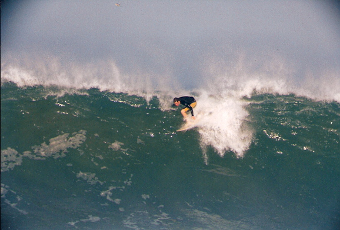
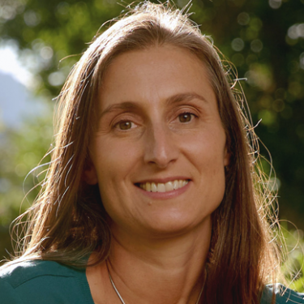
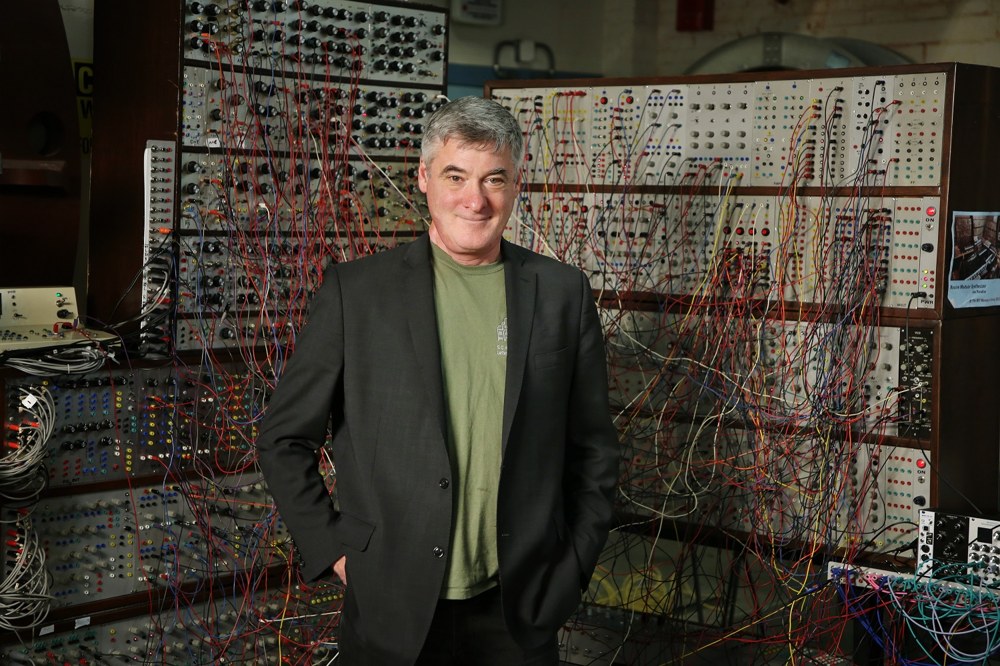

---
This workshop aims to highlight work being done at the intersection of AI and the Earth and Space Sciences, with a special focus on model interpretability at the ICLR 2022 iteration of the workshop. 

We showcase cutting-edge applications of machine learning to Earth and space science problems from diverse fields, including, but not limited to: atmospheric science, ecology and evolutionary biology, effects of environmental change on human health, geoscience, human-earth interaction, hydrology, sensors and sampling, and planetary science. 

We also cultivate areas where Earth and planetary science is informing and inspiring new developments in AI, including theoretical developments in interpretable AI models, hybrid models with knowledge-guided AI, augmenting physics-based models with AI, representation learning from graphs and manifolds in spatiotemporal models, and dimensionality reduction. New Earth and planetary science datasets and visualizations that will enable faster integration of AI into the Earth and space sciences are also of particular interest. The workshop will highlight the following contributions in special sessions: 

* Planetary and Space Science  
* Solid Earth   
* Hydrosphere  
* Atmosphere  
* Ecology     
* Sensing and Sampling  

## Important dates

Submission deadline: February 26, 2022 at 12:00 AM UTC  
Author notifications: March 26, 2022  
Workshop: April 29, 2022  

## Invited Speakers

  

[Amy McGovern (Keynote)](https://www.ou.edu/coe/cs/people/mcgovern), Professor of Computer Science and Meteorology at the University of Oklahoma, Director of the NSF AI Institute for Research on Trustworthy AI in Weather, Climate, and Coastal Oceanography

  

[Jeff Clune (Ecology)](http://jeffclune.com/), Research Team Leader at OpenAI and an Associate Professor of Computer Science at the University of British Columbia

  

[Claire Monteleoni (Atmosphere)](https://www.colorado.edu/cs/claire-monteleoni), Associate Professor  & Associate Chair for Inclusive Excellence, University of Colorado, Boulder

  

[Joe Paradiso (Sensors and Sampling)](https://www.media.mit.edu/people/joep/overview/), Joe Paradiso, Alexander W. Dreyfoos Professor in Media Arts and Science, Responsive Environments Group, MIT

[Lukas Mandrake (Space)](https://ml.jpl.nasa.gov/people/mandrake/mandrake.html), Lucas Mandrake, Senior Researcher and group supervisor of the Machine Learning (ML) and Instrument Autonomy group at JPL 

  

## Tentative Schedule

The full day workshop will feature a keynote presentation (large-attendance talk format), a panel discussion (small group talk format), and a poster session + social event. The event will be split into the following sessions (small group talk format): AI for atmosphere, ecology, water, solid Earth, sensors & sampling, and space science. Each session will feature an invited speaker and contributed talks from workshop participants, a Q&A session, and a gather.town breakout room for informal discussion and networking following the session. 

The panel discussion will focus on model interpretability and its importance to applications of AI to Earth and Space Sciences (e.g.: the design and implementation of successful environmental policy and entrepreneurship in AI for Earth Sciences). A full schedule will be posted on our website prior to the event.

## Submission instructions

We are accepting two forms of submissions: papers and posters. All submissions are due by Feb 26 '22 12:00 AM UTC.

**Paper submissions:** To format your paper for submission please use the [main conference LaTeX style files](https://github.com/ICLR/Master-Template/raw/master/archive/iclr2022.zip). The workshop has a strict maximum page limit of 5 pages for the main text and 3 pages for the supplemental text. Citations may use additional, unlimited pages.

**Poster submissions:** Please submit an abstract for consideration. 

Please note that ICLR policy states:
"Workshops are not a venue for work that has been previously published in other conferences on machine learning. Work that is presented at the main ICLR conference should not appear in a workshop."

To see examples of successful past submissions see [NeurIPS2020](https://ai4earthscience.github.io/neurips-2020-workshop/) and [ICLR2020](https://ai4earthscience.github.io/iclr-2020-workshop/).

--- 

