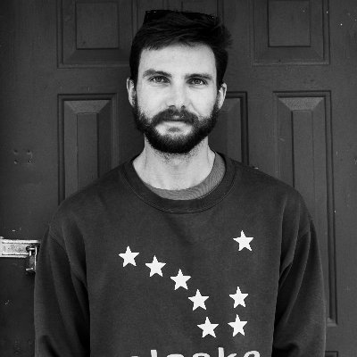
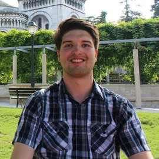

# Organizers

  

[Natasha Dudek](https://www.linkedin.com/in/natasha-dudek/), Postdoc at McGill - Mila, Deep Learning in Bioinformatics   

---

[Valentin Bickel](https://www.mps.mpg.de/staff/59397), [@valentin_bickel](https://twitter.com/valentin_bickel), Postdoc at Max Planck Institute for Solar System Research

---

[Karianne Bergen](https://www.kariannebergen.com/), [@KarianneBergen](https://twitter.com/KarianneBergen), Assistant Professor of Data Science and Earth, Environmental and Planetary Sciences at Brown University

---

[William Chapman](https://scholar.google.com/citations?user=C1ox2CEAAAAJ&hl=en), [@willericchapman](https://twitter.com/willericchapman), PhD Candidate in Oceanography from the Scripps Institution of Oceanography at the University of California San Diego

---

  

[Johanna Hansen](https://johannah.github.io), [@johanbanan](https://twitter.com/johanbanan), PhD Candidate at McGill, School of Computer Science, Mobile Robotics Lab 

---

  

[Stewart Jamieson](https://www.stewartjamieson.com), PhD Student in the MIT-WHOI Joint Program in Applied Ocean Science and Oceanography

---

# Steering Committee

[Doina Precup](https://www.cs.mcgill.ca/~dprecup/), Associate Professor, McGill University School of Computer Science, and Mila-Quebec AI Institute. CIFAR Senior Fellow, Program in Learning in Machines and Brains. Associate Scientific Director, Healthy Brains for Healthy Lives CFREF. Research Team Lead, DeepMind, Montreal. Founder, AI for Social Good Summer Lab.   

[Giulio De Leo](https://profiles.stanford.edu/giulio-de-leo), Professor of Ecology and Renewable Resource Management at the Hopkins Marine Station of Stanford University. Faculty Director of the Stanford program for Disease Ecology, Health and the Environment.    

[Gregory Dudek](http://www.cim.mcgill.ca/~dudek/), Chaired Professor, McGill School of Computer Science. VP Research & Lead Samsung AI Center Montreal. Director (on leave), NSERC Canadian Robotics Network.  General Chair, ICRA 2019. Author of over 250 articles. Expert in underwater and amphibious robotics.

[Karthik Mukkavilli](https://twitter.com/DrMukkavilli), Scientist-Entrepreneur. Co-founder/CSO at Vayuh.ai and Co-founder of Neura Lode; Founder AI4Earth and ex-Chair NeurIPS/ICML workshops. 

[Amy McGovern](https://www.ou.edu/coe/cs/people/mcgovern), Lloyd G. and Joyce Austin Presidential Professor, School of Computer Science and School of Meteorology. Director, NSF AI Institute for Research on Trustworthy AI in Weather, Climate, and Coastal Oceanography.   

[Rose Yu](https://roseyu.com/), Assistant Professor, UC San Diego Department of Computer Science and Engineering. Expert in the theory and application of machine learning to large-scale, spatiotemporal data.   

[Pierre Gentine](https://www.eee.columbia.edu/faculty/pierre-gentine), Associate Professor of Earth and Environmental engineering, Columbia University. AGU Early Career and AMS Clarence Meisinger and NASA new investigator award recipient. Expertise in land-atmosphere interactions and continental hydrological cycle.  Associate Editor of Hydrology and Earth System Sciences. Hydrometeorology and NOAA drought task force co-lead.   

[back](./)
